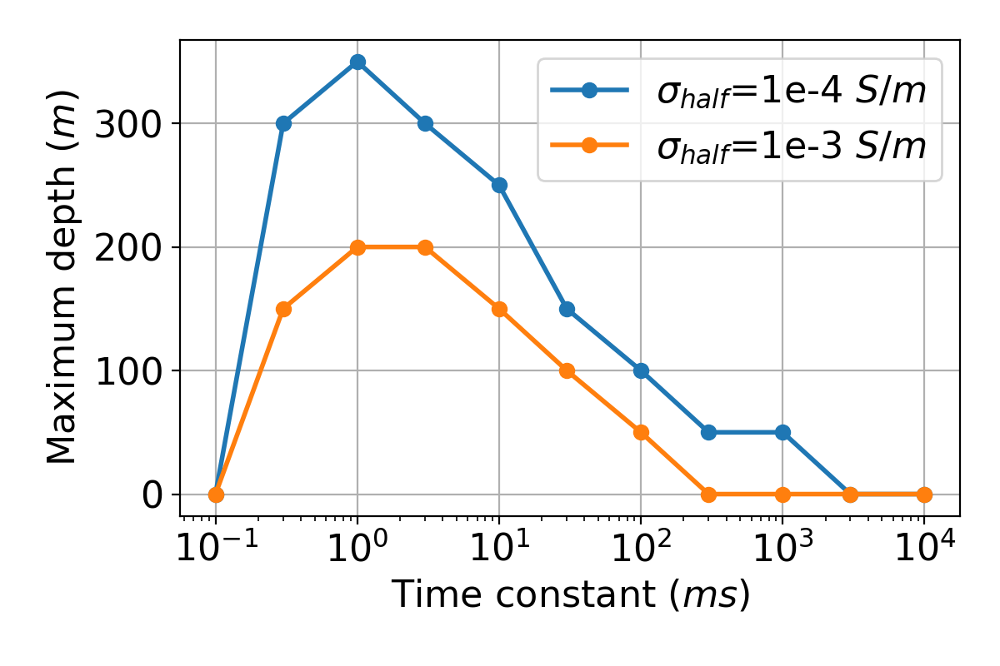

# Detecting induced polarisation effects in time-domain data - a modelling study using stretched exponentials

_Seogi Kang, Douglas W. Oldenburg and Lindsey J. Heagy_

https://doi.org/10.1080/08123985.2019.1690393



## Summary

The potential for extracting and interpreting induced polarization (IP) data from airborne surveys is now broadly recognized. There is, however, still considerable discussion about the conditions under which the technique can provide knowledge about the subsurface and thus, its practical applications. Foremost among these is whether, or under what conditions, airborne IP can detect chargeable bodies at depth. To investigate, we focus on data obtained from a coincident-loop time-domain system. Our analysis is expedited by using a stretched exponential rather than a Cole-Cole model to represent the IP phenomenon. Our paper begins with an example that illuminates the physical understanding about how negative transients (the typical signature of an IP signal in airborne data) can be generated. The effects of the background conductivity are investigated; this study shows that a moderately conductive and chargeable target in a resistive host is an ideal scenario for generating strong IP signals. We then examine the important topic of estimating the maximum depth of the chargeable target that can generate negative transients. Lastly, some common chargeable earth-materials are discussed and their typical IP time-domain features are analyzed. The results presented in this paper can be reproduced and further explored by accessing the provided Jupyter notebooks.


## Citation

Kang, S., Oldenburg, D. W., & Heagy, L. J. (2019). Detecting induced polarisation effects in time-domain data: a modelling study using stretched exponentials. Exploration Geophysics, 51(1), 122–133. https://doi.org/10.1080/08123985.2019.1690393

```
@article{kang_induced_2020,
         author = {Seogi Kang, Douglas W. Oldenburg and Lindsey J. Heagy},
         title = {Detecting induced polarisation effects in time-domain data: a modelling study using stretched 
         exponentials},
         journal = {Exploration Geophysics},
         volume = {51},
         number = {1},
         pages = {122--133},
         year = {2020},
         publisher = {Taylor \& Francis},
         doi = {10.1080/08123985.2019.1690393},
         URL = {https://doi.org/10.1080/08123985.2019.1690393}
}

```
